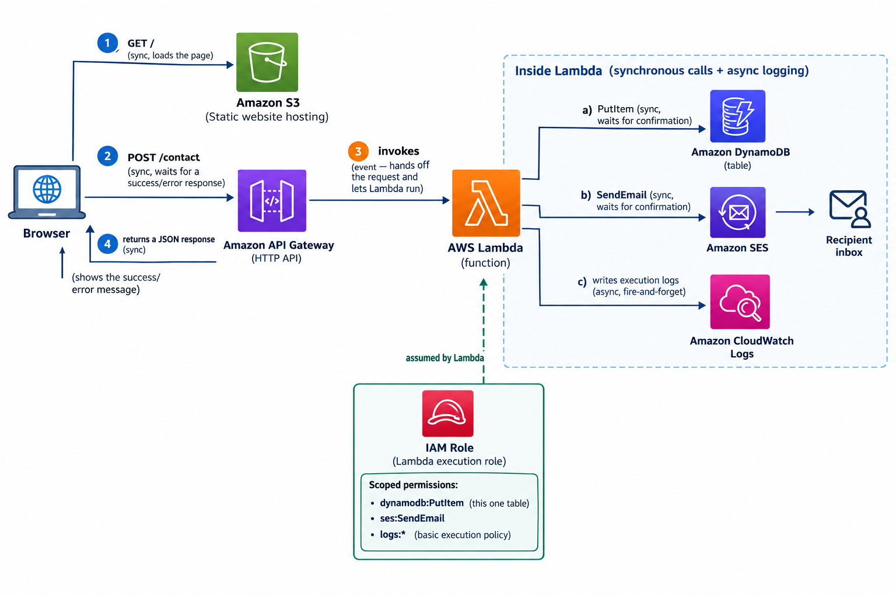

# Serverless Contact Form (AWS + Terraform)
 
## Overview
Building a serverless contact form using AWS serverless services - **S3**, **Lambda**, **API Gateway**, **SES**, and **DynamoDB** - provisioned entirely through **Infrastructure as Code (Terraform)**.
 
The goal is to design and deploy the full stack from scratch, wiring each service together and codifying the setup so it can be spun up or torn down with a single command.
 
---
 
## Architecture
 

---
 
## Prerequisites
 
- AWS account with an IAM user/role that has programmatic access
- AWS CLI installed and configured (`aws configure`)
- Terraform installed (v1.5+)
- A verified sender/recipient email in **SES** (required while in sandbox mode)
- Basic familiarity with S3, Lambda, API Gateway, DynamoDB, and IAM
---
# Step 1: Create a dedicated bootstrap configuration for remote state

Terraform's S3 backend requires an S3 bucket to already exist before any configuration can use it as a backend a circular dependency, since we'd normally create that bucket with Terraform. Terraform 1.10 also added native S3 state locking (use_lockfile = true), removing the need for a separate DynamoDB lock table.

A standalone backend-bootstrap/ configuration solves this. It creates only the state S3 bucket (versioned, encrypted, public access blocked) and keeps its own state locally on disk the one deliberate exception to "always use remote state" in this repo. Every other configuration points its backend at that bucket, with use_lockfile = true.
