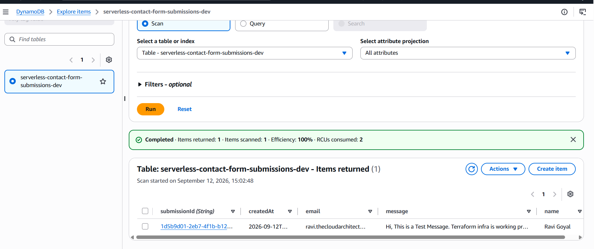
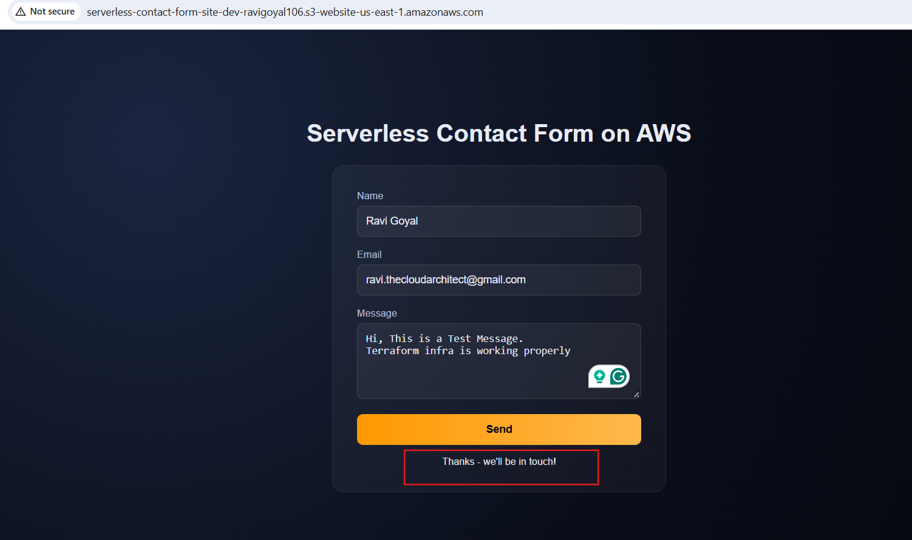

# Serverless Contact Form on AWS - Terraform Edition

[]()
[]()
[](../../actions)

A production-grade serverless contact-form backend built on AWS and provisioned entirely with Terraform.

The goal is not simply to make a contact form work. The goal is to demonstrate how to design, deploy, secure, monitor, and maintain a small AWS workload the way a real engineering team would - including the parts that did not work on the first attempt.

**Practices demonstrated:** Infrastructure as Code, serverless event-driven architecture, least-privilege IAM, remote Terraform state, OIDC-authenticated CI/CD, automated security scanning, centralized logging and alerting, input validation, and reproducible infrastructure.

---

## Table of Contents

1. [Architecture](#1-architecture)
2. [Core AWS Components](#2-core-aws-components)
3. [Observability and Reliability](#3-observability-and-reliability)
4. [Infrastructure as Code Design](#4-infrastructure-as-code-design)
5. [Deployment and Testing](#5-deployment-and-testing)
6. [CI/CD Pipeline](#6-cicd-pipeline)
7. [Security](#7-security)
8. [Challenges and Troubleshooting](#8-challenges-and-troubleshooting)
9. [Cost Model](#9-cost-model)
10. [Screenshots to Capture](#10-screenshots-to-capture)
11. [Roadmap](#11-roadmap)
12. [Deployment Checklist](#12-deployment-checklist)
13. [Final Takeaway](#13-final-takeaway)

---

# 1. Architecture


A visitor loads the static form from S3, submits it to API Gateway, which invokes Lambda. Lambda validates the input, writes the submission to DynamoDB, and sends a notification email through SES. Every invocation is logged to CloudWatch, which raises an alarm through SNS if Lambda starts erroring or gets throttled.

The important architectural characteristic is that **there is no continuously running application server** - compute only runs when someone actually submits the form.

---

# 2. Core AWS Components

* **Amazon S3** hosts the static frontend (HTML/CSS/JS). No server is needed just to serve static files. The live API URL is injected into the HTML at deploy time via Terraform's `templatefile()`, rather than hand-edited.
* **API Gateway (HTTP API)**, not REST API, is the public entry point. This workload only needs one route and native CORS support, so the simpler, cheaper HTTP API is the right fit - the principle being to choose the simplest configuration that satisfies the actual requirement, not the most feature-complete one.
* **AWS Lambda** contains the backend logic: validate the request, write to DynamoDB, send the email. A good fit because contact-form traffic is sporadic - there's no reason to keep a server running just to wait for occasional submissions.
* **DynamoDB (on-demand billing)** stores each submission. No database server to operate, and on-demand billing means no capacity planning for traffic that is small and unpredictable.
* **Amazon SES** sends the notification email. Purpose-built for transactional email, unlike SNS, which is a pub/sub messaging service. The DynamoDB record remains the system of record regardless of whether the email succeeds.
* **IAM** grants Lambda only what it needs - writing to one specific DynamoDB table, sending through SES, writing its own logs. No broad `dynamodb:*` or account-wide access. IAM also scopes exactly which API Gateway is allowed to invoke this specific Lambda function, not API Gateway in general.
### DynamoDB console showing a stored submission item



---

# 3. Observability and Reliability

* **CloudWatch Logs** captures every Lambda invocation automatically, with an explicit 30-day retention policy rather than the default of keeping logs forever.
* **A CloudWatch alarm on Lambda errors** - a meaningful signal for a contact form, since an error means a real submission failed somewhere downstream.
* **A CloudWatch alarm on Lambda throttling** - unusual for this workload, which makes it a useful indicator if it ever starts happening.
* **SNS notifications** turn both alarms into an actual email to the operator, on the principle that monitoring is only useful if somebody can act on it.
* **Request validation** inside Lambda rejects missing fields and malformed email addresses before anything reaches DynamoDB or SES, and logs why a request was rejected.
---

# 4. Infrastructure as Code Design

Each AWS service is a separate, reusable Terraform module (`dynamodb-table`, `iam-lambda-role`, `lambda-function`, `ses-identity`, `api-gateway-http`, `s3-static-site`, `observability`) rather than one large configuration. The `environments/dev` directory wires these modules together, so a future `prod` environment can reuse the same modules with different values instead of duplicating the implementation.

Resources are built in dependency order - DynamoDB and IAM first, then Lambda and SES, then API Gateway and the frontend, then monitoring - because each layer needs a real output (an ARN, a role) from the one before it. Terraform resolves this automatically from resource references, which is the actual advantage of Infrastructure as Code over manually sequencing the same build through the AWS Console.

Terraform state is stored remotely in S3, created by a small standalone `backend-bootstrap` configuration that solves the circular dependency of Terraform needing a backend before it can create one. That bootstrap also provisions the GitHub OIDC trust relationship used by CI/CD.

One Terraform-specific detail worth knowing: backend configuration blocks cannot reference variables. The state bucket name has to be pasted into `environments/dev/backend.tf` as a literal value after the bootstrap runs - a small detail, and the direct cause of more than one troubleshooting session (see [Section 8](#8-challenges-and-troubleshooting)).

---

# 5. Deployment and Testing

**Bootstrap the backend and CI trust (once):**
```bash
cd backend-bootstrap
cp terraform.tfvars.example terraform.tfvars
terraform init && terraform apply
```

**Point the environment at the new bucket**, then deploy:
```bash
cd environments/dev
cp terraform.tfvars.example terraform.tfvars
terraform init
terraform plan
terraform apply
```

SES and SNS both require clicking a verification/confirmation email before they'll actually work - a deployed resource is not the same as a functioning one.

**Testing checklist**, run after every deploy:
* Load the site, submit a valid form, confirm a success response.
* Confirm the item appears in DynamoDB.
* Confirm the notification email arrives.
* Check CloudWatch logs for the invocation.
* Submit invalid input and confirm it's rejected before reaching DynamoDB or SES.
* Verify the CORS preflight independently with `curl`, to isolate a browser issue from an API configuration issue.


---

# 6. CI/CD Pipeline

GitHub Actions runs `terraform fmt -check`, `terraform validate`, a `tfsec` security scan, and `terraform plan` on every pull request - before any change reaches `main`. A `concurrency` group ensures two deployments can never run against the same state at once.

Authentication to AWS uses **OpenID Connect (OIDC)** - GitHub issues a short-lived, cryptographically signed token scoped to this specific repository, which AWS exchanges for temporary credentials. No AWS access key is stored anywhere in the repository or GitHub's secrets.

Merging to `main` triggers `terraform apply`, but only after a required manual approval on a GitHub Environment named `production` - no infrastructure change reaches AWS without a deliberate, visible click, regardless of how the merge happened.

---

# 7. Security

* **Least privilege everywhere** - Lambda's role can only write to one table, send email, and log. No `AdministratorAccess`, no wildcard service access.
* **Resource-scoped CI/CD role** - the GitHub Actions deploy role is restricted to resources whose name matches this project's naming prefix. Within that scope, broad service actions are allowed rather than individually enumerated, after narrower action lists repeatedly broke on routine read/tagging calls Terraform's AWS provider makes automatically (see [Section 8](#8-challenges-and-troubleshooting)). The resource boundary, not the action list, is the real control.
* **No long-lived CI credentials** - OIDC only, covered above.
* **Public repo, automatic protection** - GitHub's secret scanning and push protection are on by default for public repositories, at no cost.
* **Account ID exposure was found and remediated** - AWS error messages printed into public CI logs contained full ARNs, which include the account ID (Variables aren't redacted in logs the way Secrets are). The account ID was registered as a GitHub Secret specifically so future log lines containing it get redacted automatically, and historical run logs were cleaned up manually where practical.
* **CI/CD access is revoked, not left standing** - the OIDC trust and deploy role are destroyed via Terraform when not actively developing, and recreated in under a minute when needed again. This is treated as an active practice, not a one-time setting.

---

# 8. Challenges and Troubleshooting

Real infrastructure work does not go from `terraform apply` to "everything works" on the first try. These are the actual problems hit while building this, in order:

* **A module reached outside its own directory** using `templatefile()` with a relative path that only worked by coincidence of how deep it was called from. Fixed by having the module accept pre-rendered content as an input instead.
* **A stale Terraform state lock** followed a network-related hang during an `apply`, requiring `terraform force-unlock` with the reported lock ID once confirmed nothing was still genuinely running.
* **Duplicate and orphaned AWS resources** accumulated after retrying failed applies during that same network issue. Resolved by manually auditing and clearing every AWS console, fully emptying and recreating the versioned state bucket, and rebuilding the entire environment from Terraform alone - proving the infrastructure was genuinely reproducible from code.
* **`EntityAlreadyExists` on a supposedly clean rebuild** turned out to be one IAM role missed during that manual audit, not Terraform being confused.
* **CI silently used the wrong AWS region** because `terraform.tfvars` is gitignored and therefore invisible to GitHub Actions - fixed by passing required variables in as `TF_VAR_*` environment variables sourced from GitHub repository variables.
* **A branch protection rule locked the repository owner out of merging their own pull request**, since GitHub defaults to requiring one approval and disallows self-approval. Removed the approval requirement, kept the required status check.
* **Repository variables were briefly added under the wrong scope** (Environment instead of Repository), making them invisible to the `plan` job, which isn't bound to that environment.
* **`Not authorized to perform sts:AssumeRoleWithWebIdentity`** despite every visible config checking out, traced by decoding the actual OIDC token GitHub issues - which now embeds immutable numeric IDs alongside the repo owner/name in its `sub` claim, a format the original trust policy pattern didn't account for.
* **An overly narrow IAM action list** blocked normal `terraform apply` operations on unrelated read/tagging calls (`dynamodb:DescribeContinuousBackups`, `s3:GetBucketTagging`) that aren't practical to enumerate in advance - resolved by scoping resources tightly and widening the allowed actions within that scope.
* **Re-running an old GitHub Actions run replayed the old workflow file**, not the current one on `main` - a fresh commit was needed to actually exercise recent fixes.

These are included deliberately. Diagnosing real, not simulated, infrastructure failures - and knowing the difference between a genuine bug and an environment quirk - is the actual skill this project set out to demonstrate.

---

# 9. Cost Model

No permanently running compute or database. At low, portfolio-project traffic, the realistic cost is close to zero - fractions of a cent across API Gateway, DynamoDB, and SES, with Lambda and CloudWatch logs falling inside AWS's permanent free tier. AWS pricing and free-tier terms can change, so this should be read as "no major always-on cost," not a permanent guarantee of zero.

---
# 10. Roadmap

* A `environments/prod` directory, reusing the same modules with production settings.
* CloudFront + ACM in front of the S3 site, replacing the public bucket with real HTTPS on a custom domain.
* `Checkov` added alongside the existing `tfsec` scan for broader coverage.
* AWS X-Ray for per-request latency visibility across API Gateway, Lambda, DynamoDB, and SES.
* A CloudWatch dashboard for submission volume and invocation trends, complementing the existing failure-focused alarms.

---

# 11. Deployment Checklist

**Infrastructure:**
- Terraform initializes cleanly remote state configured.
- DynamoDB table exists.
- Lambda function exists. 
- IAM role scoped correctly. 
- API Gateway endpoint live.
- S3 frontend deployed.
- SES identity verified. 
- SNS subscription confirmed. 
- CloudWatch log group and alarms exist.

**Application:** 
- site loads and valid submissions succeed, invalid submissions are rejected ,data lands in DynamoDB ,email arrives, logs are visible.

**CI/CD:** PRs run plan + tfsec 
- AWS auth is OIDC only, no stored keys.
- production deploys require manual approval.
- account ID is registered as a secret for log redaction.

---

# 12. Final Takeaway

A contact form is a simple requirement. The value here is in how it's built, managed services matched to each responsibility, permissions scoped to what's actually needed, infrastructure defined as code and proven reproducible by actually rebuilding it from scratch, deployments automated but never unattended, and every real failure along the way documented rather than hidden.

---